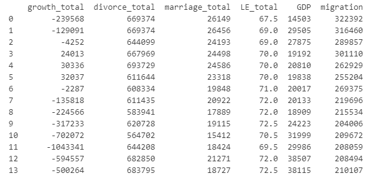
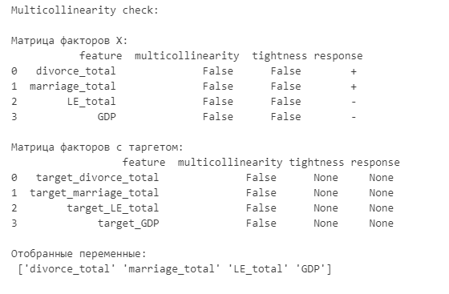
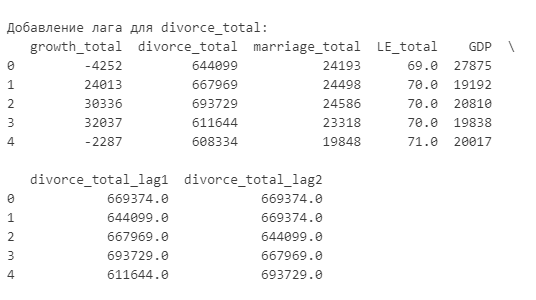
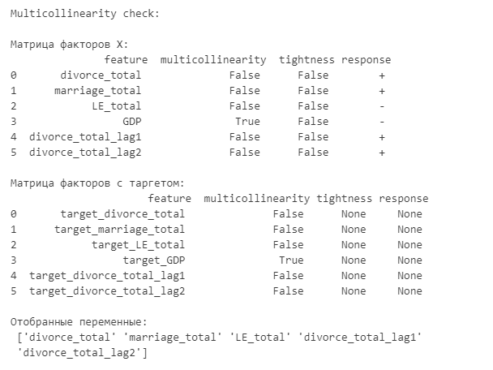
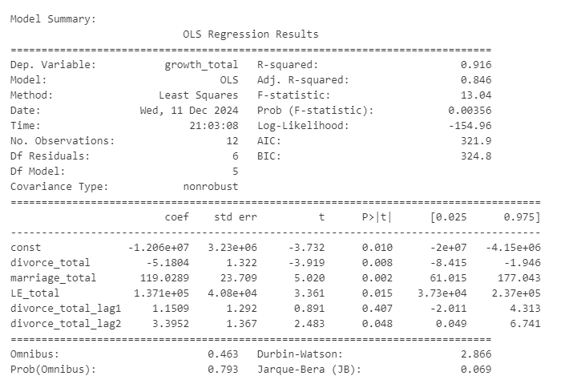
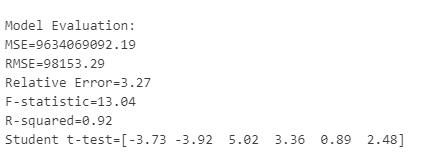
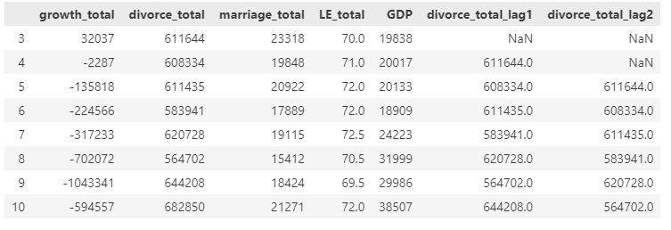

# Лабораторная работа 2

## Начало работы

Этот скрипт реализует анализ данных и построения класса линейной регрессии с возможностью выполнения следующих операций:

1. Анализ факторов модели по критериям: мультиколлинеарность, теснота, наличие отклика 
2. Добавление лагов к переменным
3. Обучение модели линейной регрессии на выбранных переменных
4. Оценка линейной модели метриками RMSE, MSE, коэффициентом детерминации (R-squared), F статистикой (F-statistics), тестом Стьюдента (Student t-test).
5. Возможность выбора подмножества исходного ряда данных для обучения модели
6. Прогнозирование значений целевой переменной на новых данных


Для знакомства можно запустить в терминале следующую строку ```python.exe lab2/linear_regression.py lab2/data/final_dataset.txt target```

## Пример реализации на данных

Данные были собраны с сайта росстата и содержат следующие переменные:




1. Проверка на мультиколлинеарность



2. Добавления лагов





3. Обучение линейной модели на отобранных переменных



4. Оценка модели на метриках



5. Выбираем подотрезок с 2013 по 2020 год



6. 