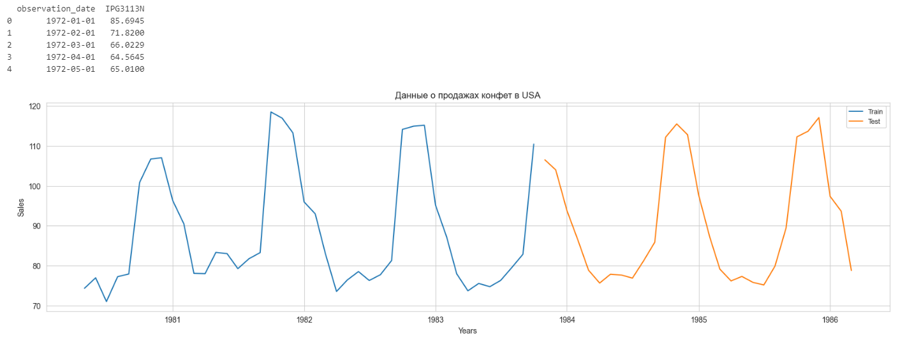
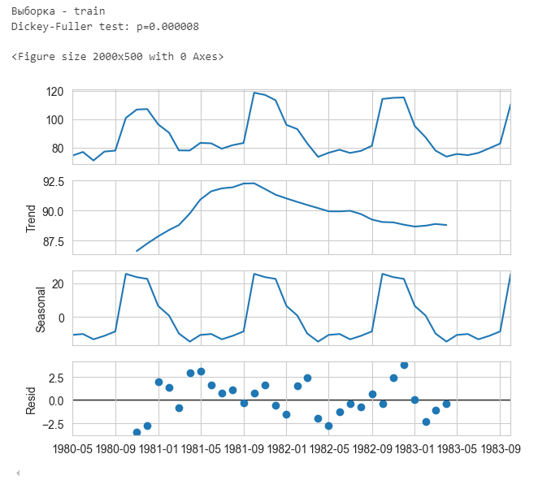
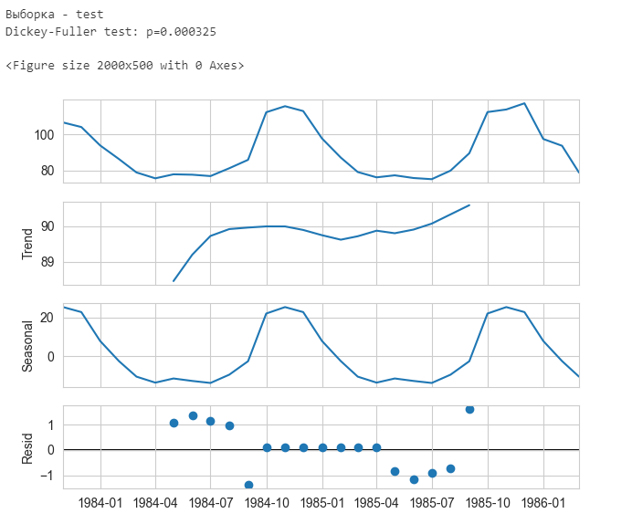
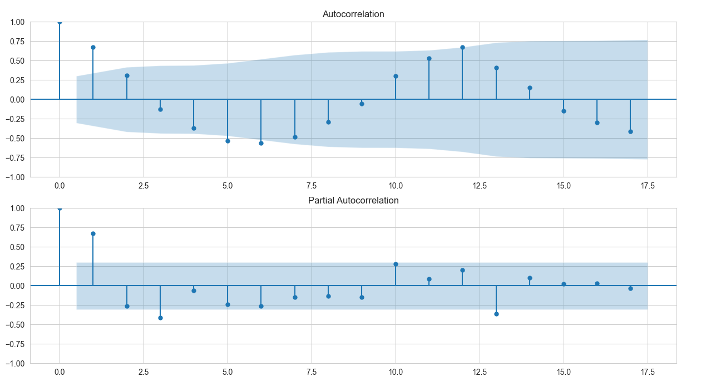
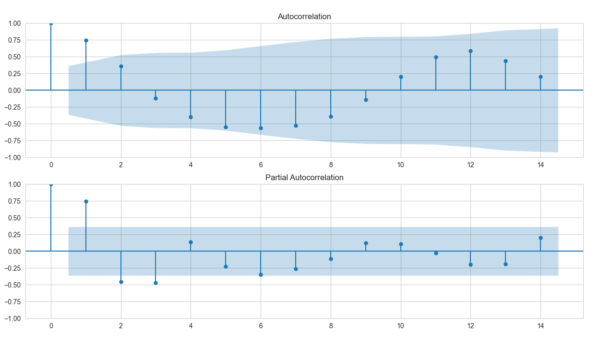
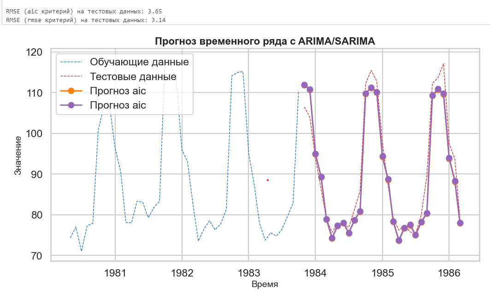
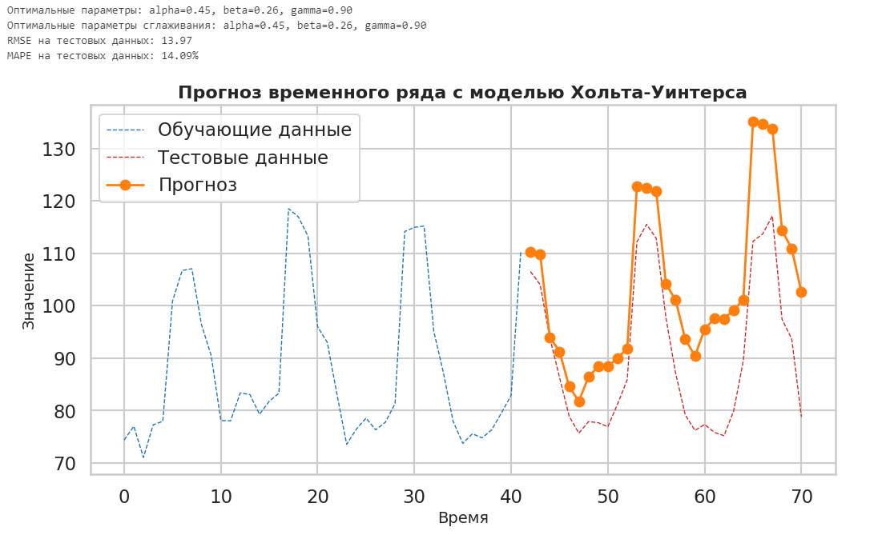

# Лабораторная работа 3

В этом скрипте производился анализ применения моделей типа ARIMA/SARIMA дял прогнозирования временного ряда. В ходе анализа было проделано:

1. Визуалиазация и отбор данных
2. Оценка стационнарности, автокорреляции и частичной автокорреляции в том числе построение графиков ACF и PACF 
3. Подбор оптимальных параметров моделей ARIMA/ SARIMA методом ```sm.tsa.statespace.SARIMAX``` 

## 1. Визуалиазация и отбор данных

В качестве данных были использованы отчеты по продажам конфет в США за период с 01.01.1972 по 01.01.1987. Данные были разделены на обучающую и тестовую выборки в отношении 60:40. График и пример данных приложен ниже: 



## 2. Оценка стационнарности, автокорреляции и частичной автокорреляции в том числе построение графиков ACF и PACF 

Анализ train и test выборок показал:

    1. Оба ряда являются стационнарными, т.е. выполнены предпосылки для использования ARIMA моделей, а также нет необходимости применять дифференцирование или другие методы по нормализации временного ряда (рис.1, рис.2)
    2. Анализ графиков ACF и PACF показал, что из-за характера снижения на графике ACF и резкому падению после 1-ой компоненты, что процесс ближе к авторегрессионная модели (AR) с лагом 1 (рис.3, рис.4).   

рис. 1


рис. 2


рис. 3


рис. 4


## 3. Подбор оптимальных параметров моделей ARIMA/ SARIMA 

```
ps = range(0, 2) # AR компонент выбирается при отклонении от порогового значения (синяя область) на графике PACF. В данном случае видно, что значительные отклонения присутствуют только на 1 лаге и сезоном лаге = 12. Но можно добавить еще 1 для эксперимента, поэтому от 0 до 2
d  = 0 # потому что дифиренцирование с лагом 1 уже стационарный ряд и таким образом не сильно разрушаем зависимость в данных
qs = range(0, 2) # Аналогичная ситуация, как с AR, но смотрим на график ACF и видим, что ситуация схожа. Поэтому от 0 до 2
Ps = range(0, 2) # выбираем аналогично AR, но для меньшего числа переборов оставим от 0 до 1
D  = 0 
Qs = range(0, 2) # выбираем аналогично MA, но для меньшего числа переборов оставим от 0 до 1
order = [6,12]

parameters = product(ps, qs, Ps, Qs, order)
parameters_list = list(parameters)
print("Number of analysed models:", len(parameters_list))


# here we will choose the best model
results = []
best_aic = float("inf")
best_rmse = float("inf")

for param in parameters_list:
    
    # try except for the case of wrong parameters
    try:
        model = sm.tsa.statespace.SARIMAX(
            train_series.values,
            order=(param[0], d, param[1]),
            seasonal_order=(param[2], D, param[3], param[4]),
        ).fit(disp=-1)

    # print wrong parameters and go on
    # AIC criteria:
    except ValueError:
        print("wrong parameters:", param)
        continue
    aic = model.aic
    preds = model.forecast(test_series.values.shape[0])
    rmse = root_mean_squared_error(test_series.values, preds)

    # save best model, aic, parameters
    if aic < best_aic:
        best_model_aic = model
        best_aic = aic
        best_param_aic = param
        aic_forecast =  preds.copy()

    # save best model, aic, parameters
    if rmse < best_rmse:
        best_model_rmse = model
        best_rmse = aic
        best_param_rmse = param
        rmse_forecast =  preds.copy()


    results.append([param, model.aic, rmse])

```


Количество моделей: 32

Table 1: Результаты оптимизации по AIC

| Parameters      | AIC       | RMSE       |
|-----------------|-----------|------------|
| (1, 0, 1, 1, 12) | 270.930120 | 3.651047   |
| (1, 0, 1, 0, 12) | 271.124510 | 9.303033   |
| (1, 1, 1, 1, 12) | 272.842259 | 3.582037   |
| (1, 1, 1, 0, 12) | 273.104458 | 9.511570   |
| (1, 0, 0, 1, 12) | 304.298617 | 14.816812  |

Table 2: Результаты оптимизации по RMSE

| Parameters      | AIC       | RMSE       |
|-----------------|-----------|------------|
| (0, 0, 1, 1, 12) | 330.638621 | 3.141400   |
| (1, 1, 1, 1, 12) | 272.842259 | 3.582037   |
| (0, 0, 1, 0, 12) | 334.736022 | 3.605568   |
| (1, 0, 1, 1, 12) | 270.930120 | 3.651047   |
| (0, 1, 1, 0, 12) | 306.371027 | 3.685419   |




